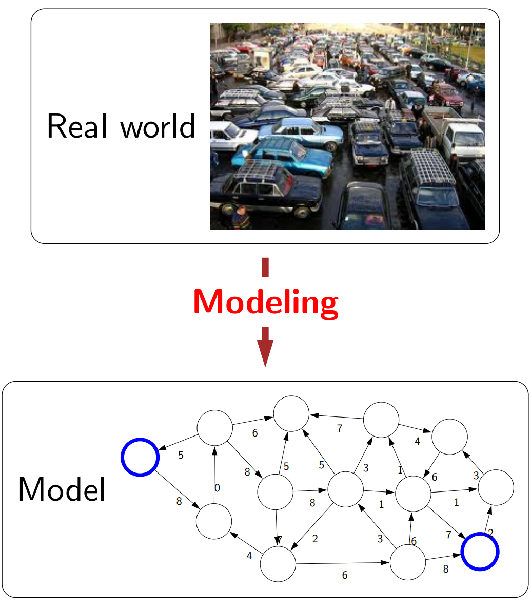
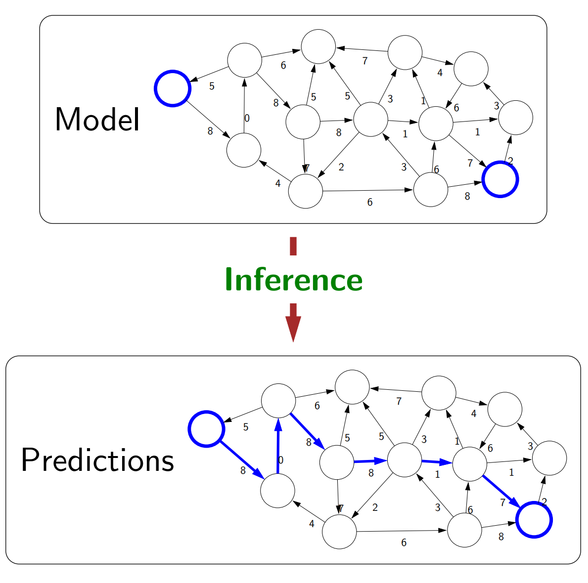
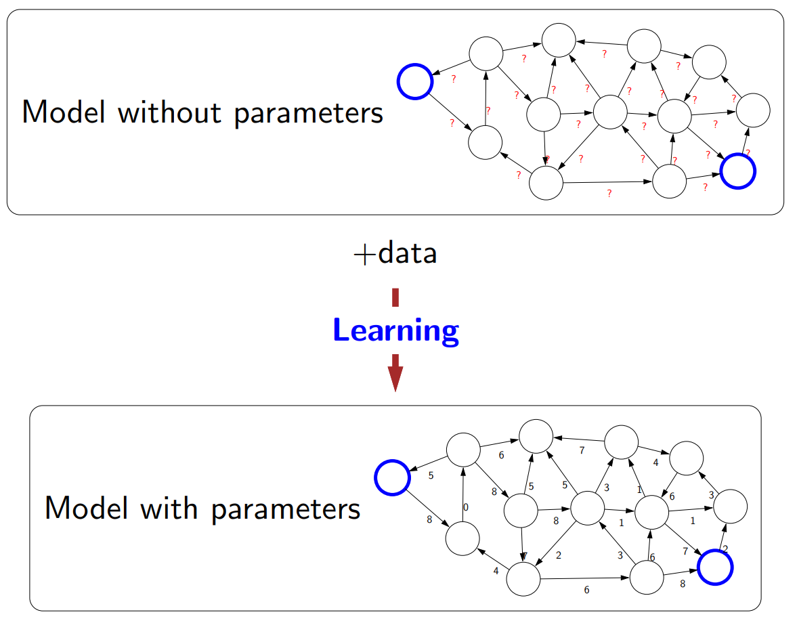
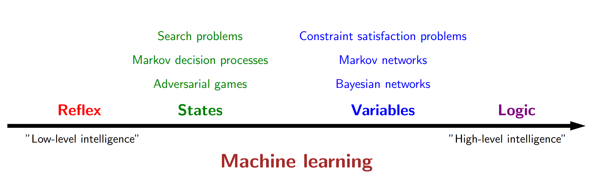

---
# Name of the article
title: "Quick note on the definition of AI"

# Quick description
description: A perspective from Stanford's AI course - CS221

# Author of the article
author: Dung Minh Dao

# Appears as the tail of the output URL.
slug: "quick-note-on-the-definition-of-ai"

# Date created
date: 2022-05-25T20:13:33+07:00

# Date published. Before that day, the post can not be available
publishDate: 

# Daye expired. After that day, the post can not be available
expiryDate:

# Last modified time of the file
lastmod: 
    - :fileModTime
    - :git
    
# Article's tags
tags: 
    - course-review
    - machine-learning
    - stanford-ai

# Article's categories: Blog, Project or Guideline
categories:
    - Guideline

# Allow share?
socialShare: true

# Useful to link articles together for "See also" part
series: Stanford's AI courses

# is Math included? Default: false
math: false

# Cover image of the article
image: Artificial-Intelligence.jpg

# License. Default: CC BY-NC-SA 4.0
license: MIT

---

As a final-year student who has some experience about artificial intelligence(AI) and machine learning (ML), it's great for me to have a chance to revisit the definition of AI through the introductory course to AI at Stanford University - CS221 - which content is available online. This is also a chance for me to look back at the Introduction to AI course that I studied in my second year at Hanoi University of Science and Technology (HUST).

# What is AI/ML for me, before this course?
After many days of reading online content about the definition of AI in my early years at the university, I finally came up and satisfied with a definition of AI that seem to be general enough. In my own expression: **"Artificial Intelligence is any kind of simulation that exhibit a feature of intelligence"**. This definition, to me, is acceptable for a number of reasons:
* Some definitions equalize intelligence to human intelligence, which I believe is a limit to themselves. Animals exhibit some kinds of intelligence, and there can be types of intelligence that human don't have.
* Simulations are created by human in general, but the "simulation" here is meant to be equivalent to "artificial" - not occuring in the nature.
* There are many type of intelligence and abilities associate with intelligence - as from Wikipedia, abstraction, logic, understanding, learning, emotional knowledge, etc. - and there is also no single definition for intelligence. So exhibition of one those traits is acceptable.

The definition of machine learning by Tom M. Mitchell in his book Machine Learning is commonly accepted by everyone: 
>"A computer program is said to learn from experience E with respect to some class of tasks T and performance measure P if its performance at tasks in T, as measured by P, improves with experience E."

ML is often regarded as a subset of AI. The difference here is, ML has an element called **"learning"** - improvement of performance with more data/experience

# My unanswered questions
You might ask "So what is the problem for you definition?". Actually, I know that I can have a good definition for my own. The next step is what make me interested in: **"How to categorize AI/ML in such a way that aligns well with some aspects of natural intelligence?"**. In fact, there are already some common ways of categorizing AI or ML:
* Grouping by learning methods: supervised learning, unsupervised learning, reinforcement learning,...
* Grouping by type of tasks: computer vision, natural language processing, speech processing,...

While these groupings are useful, I'm still not contented, since they are unnatural:
* The groupings just "split" problems in AI/ML into group according to human-defined concepts (e.g: supervised) or functionalities of human (e.g: see - computer vision, or speak - speech processing) - which **ignores general aspects of intelligence (e.g: logic, abstraction) mentioned above**
* There is not much thing to compare between groups. **There isn't seem to exist a scale from "low" to "high"** to measure any aspect of each category in comparison with other categories

# Introduction to AI course at my university, and my doubt
These are topics that were mentioned in my AI class:
* Searching problems: tree methods (BFS, DFS), heuristic methods, constraint satisfaction problem (CSP)
* Logic: Propositional logic, First-order logic
* Machine learning: Some common methods (kNN, naive bayes, decision tree, neural network)

Studying this course made me feel that there wass some kind of ordered categorization here. Maybe the difficulty of the problems is the scale that I'm looking for? Or, the scale is based on how abstract the problems are?

At the beginnning of the course, there was an introduction and overview of AI history. However, we students were not told why the course was structured in that way - we only knew the topics.

# What I learned and deduced from Stanford's AI course
First, from the view of this course's lecturer, there are 3 pillars to AI: Modeling (create a mathematical/logical representation of the real world), Inference (answer questions about models, e.g: shortest path, winning strategy), and Learning (transform an abstract model into a concrete one, with the help from additional data). 

  
   
  

The below image pretty much sums up the categorization of AI/ML problem/model types used in this course. They are sorted by the "low-high" level of intelligence:
* **Reflex-based model** is a *fixed sequence of computations* to get the output. This is equivalent to daily reflexive task that we can do very quickly, such as recognizing an object in the house
* **State-based model** considers available *states* and *actions* at each state, as well as plan the step-by-step actions that will followed. This is the model of some of our favorite games such as chess and go, or some riddles for children like the prisoners' dilemma
* **Variable-based model** deals with assignment of *variable* with respect to some *factors/conditions*, regardless of order. Sudoku is a game that can be well-modelled in this category.
* **Logic-based model** can digest heterogeneous information into some *syntax* and *semantic* representations, and reason deeply using *inference rules*. The common logical analysis we often do in daily life can be represented by this type of model. 

**So there is an ordered categorization here!!!**. A great news for me. However, to make the ordering clearer, I read through the course and try to **make some scales to organize the problems/models according to the 3 pillars mentioned above**. Here is my own summary of analysis, based on what I learned from the course:

| Pillar    | Reflex                                                  | States                                                    | Variables                                                    | Logic                                                                         | Conclusion                                                                                       |
|-----------|---------------------------------------------------------|-----------------------------------------------------------|--------------------------------------------------------------|-------------------------------------------------------------------------------|--------------------------------------------------------------------------------------------------|
| <r>**Modeling**</r>  | abstract model, "massive lookup  table of best actions" | local interactions between  states (like in graph)        | solutions are assigned to  variables (lots of possibilities) | syntax and semantics,  highly expressive                                      | Models get **simpler** and **more expressive**.  Moving from abstract → concrete (less learning) |
| <g>**Inference**</g> | follow a fixed sequence of  steps to get the output     | combine local interactions to  get optimization solutions | find assignments to variables, or probabilistic inference    | draw (deep) logical reasoning from  knowledge, but rules can be deterministic | Inference gets **more complex**,  and **handles less uncertainty**                               |
| <bl>**Learning**</bl>  | have to learn from (lots of) data                       | get data through exploration  action                      | need few data, incorporate prior  domain knowledge           | rule-based, don't allow fine-tuning  through data                             | Learning gets **easier** - but **lower ability  to fine-tune** through additional data           |

# Conclusion
In the end, I have found what I need: an ordered grouping that "aligns well with some aspects of natural intelligence". This categorization also fill in the hole of my understanding about how my university's Introduction to AI course was structured.

Needless to say, there are many topics covered in this course. I think this is a very good course for anyone who want to get an overview of what AI is, and it can also be a starting point to find out more on specific topics of AI/ML.

# Reference
* Background image: https://upload.wikimedia.org/wikipedia/commons/thumb/4/42/Artificial-Intelligence.jpg/1024px-Artificial-Intelligence.jpg
* CS221 - Spring 2022 lecture slides (and image references): https://stanford-cs221.github.io/spring2022/modules/
* Intelligence - Wikipedia: https://en.wikipedia.org/wiki/Intelligence

