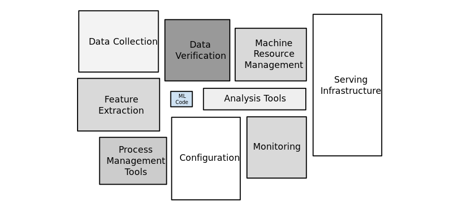
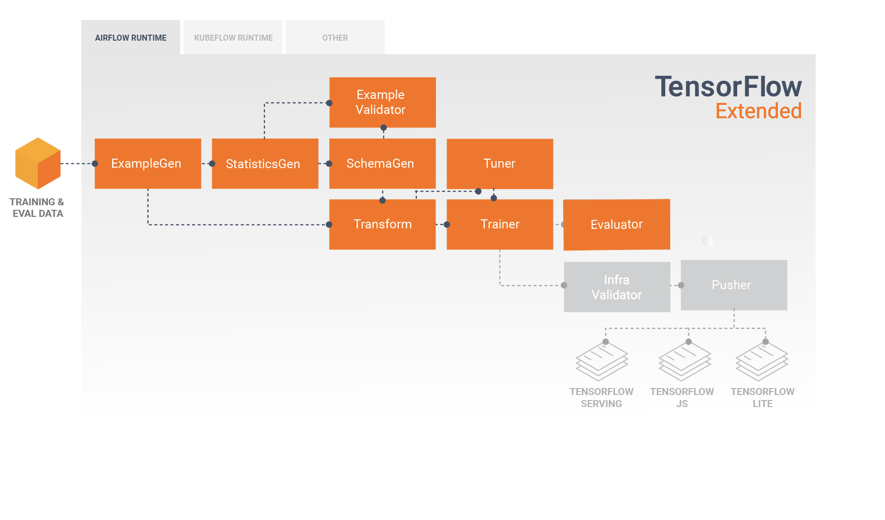
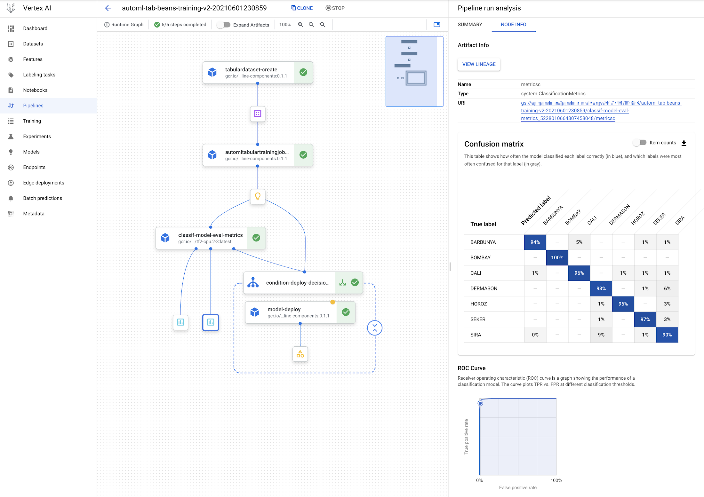
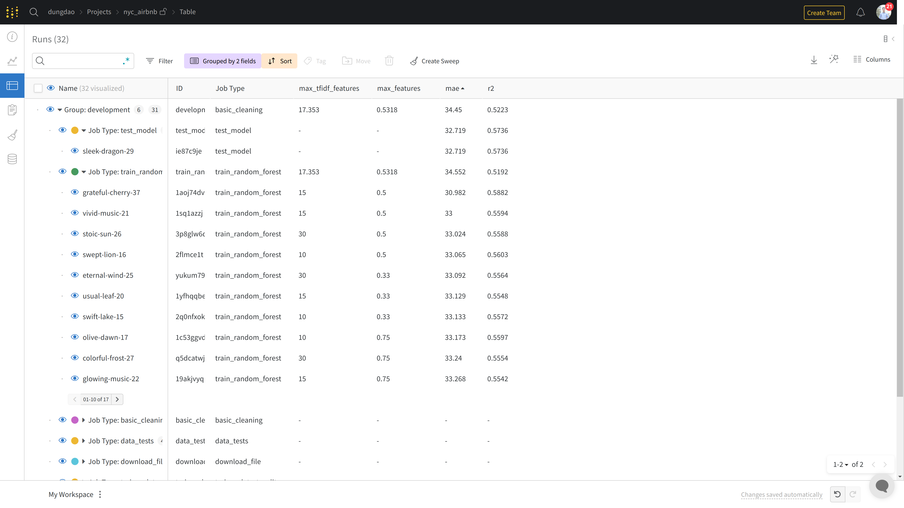
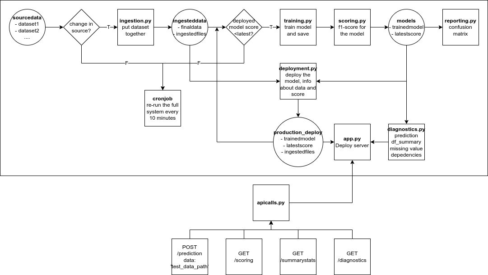

---
# Name of the article
title: "Machine Learning Operation (MLOps) Courses Review"

# Quick description
description: Quick review and suggestion for anyone who want to study MLOps

# Author of the article
author: Dung Minh Dao

# Appears as the tail of the output URL.
slug: "mlops-courses-review"

# Date created
date: 2022-05-18T08:59:52+07:00

# Date published. Before that day, the post can not be available
publishDate: 

# Daye expired. After that day, the post can not be available
expiryDate:

# Last modified time of the file
lastmod: 
    - :fileModTime
    - :git
    
# Article's tags
tags: 
    - mlops
    - machine-learning
    - course-review

# Article's categories: Blog, Project or Guideline
categories:
    - Guideline

# Allow share?
socialShare: true

# Useful to link articles together for "See also" part
series: MLOps

# is Math included? Default: false
math: false

# Cover image of the article
image: background.png

# License. Default: CC BY-NC-SA 4.0
license: MIT

---

Hi. This is the first course review I've ever done on my blog, and today I will review the 2 series of courses on the same topic: Machine Learning Operations, or MLOps for short. 

**What to expect in this review**:
* An overview of what these programs do and don't provide
* The topics that are focused in each series and technological stacks used
* Methods of teaching, reviewing, and testing
* My experience studying each of these programs: what I find interesting (and what need to be improved)

**What NOT to expect in my review**:
* Details on each of the topics (though I do provide some insights)
* How to complete each projects and tests

# Why should you care about MLOps?
For most of beginners in Machine Learning or AI, it is a common practice to use notebooks and simple files to do experiments with readily available datasets, run and fine-tune a number of models. While this could be a good starting point for developing practical models, things are quite different in the production scenarios.

I will not list all of the cumbersome theoretical and practical issues here, as the readers can easily search for posts on the topic of MLOps, as well as find some insights on the problems that MLOps solves through the rest of my course review. However, here is a simple summary of some of the problems that MLOps can provide solutions:
* The real-world data are constantly changing, which needs investigation to take action
* ML models need to be easy to run, fine-tune, and track to ensure good performances
* The ML project code should be organized in a pipeline with tracked dependencies for reproducibility and fault tolerance 
* When put into production, model performance should be constantly monitored and retraining should be trigger when there is a significant performance downgrade
* Model fairness, information securities,... are also problems for MLOps to deal with

<b>Figure 1</b>: This is how production ML system looks like

You can see that in the end of the day, ML engineers have to work with many other stakeholders - software engineers, data engineers, DevOps, customers, and managers - to implement a successful MLOps project.

# A quick summary of courses and their providers
This topic is pretty new, and there are multiple approaches to deal with it. I have experience studying 2 series of courses on the topic of MLOps. The providers of these 2 courses have great reputation in organizing online courses in the topic of Machine Learning. Although these 2 programs are designed for a 3 to 4 months period of studying, it is personally beneficial for me to study each of these program in 1 month (as I can fully focus on MLOps topics). Links for these programs can be found at [the reference part](#references). Let's have an overview:
* **Coursera Machine Learning Engineering for Production (MLOps) Specialization**: Well, another specialization provided by DeepLearning.AI; and from the past experience with their famous ML courses, I had a great expectation that this would be an another wonderful journey. Coursera's courses can be audited for free, or you can get a financial aid to study these courses at a reasonable price - and sometimes for free!
* **Udacity Nanodegree in Machine Learning DevOps Engineer**: the first Nanodegree program I have ever taken, and I study this course as a part of training in my company. For the regular students, you can take the courses with the price of as low (or high?) as $120. The price goes with benefit, of course: in return, you will get personalized assessment and suggestion for your project submissions

# Coursera MLOps Specialization
This is a series of 4 courses, the first course is an introduction, and each of the other 3 courses focus on a specific topic: Data Lifecycle, Modeling Pipelines, and Deploying in Production. **TensorFlow Extended (TFX) platform** is used for for creating production ML pipelines; the pipelines' components are introduced throughout the last 3 courses. Besides, other libraries (`ml_metdata`, `sklearn`) and technological platform related to Tensorflow (such as Google Cloud Platform) are also frequently used. A basic familiarity with the Tensorflow library can help you in some scenarios.

<b>Figure 2</b>: TensorFlow Extended Pipeline for production ML

In every course, there is a series of videos introducing new concepts. After a few videos, small quizzes are provided to test how well you understand these concepts, and there are also hand-on labs for practical experiences. Each course final score is determined by a combination of some specific quizzes and hand-on labs score.

## Benefit of taking this program
This specialization introduce a lot of recent concept in Machine Learning and AI such as Semi-supervised learning, Neural Architecture Search (NAS), and Knowledge Distillation. I also find interesting recent techniques in handling data (feature transformation, feature selection) and working with models (quantization and pruning). 

Using a common platform (TFX) for creating pipeline make the courses in this specialization well-connected and coherent. A wide range of tools revolves around Tensorflow, especially from Google Cloud Platform, also help me to explore the new tools to train and deploy models automatically.

**Side notes**: There are some guides provided by **Qwiklabs** that help learners gain familiarity with deploying ML models on Google Cloud Platform in this courses. I recommend checking out other courses from **Qwiklabs** for basic understanding of the whole platform. Signing up for a **Qwiklabs** account through Google and get into the first guide, you will receive 30-days of studying any courses for free. Check out the link: https://www.qwiklabs.com/

<b>Figure 3</b>: Vertex AI on GCP for end-to-end ML workflow (Course 4)

## Drawback, or things that this program needs to improve
Unfortunately, this program requires basic knowledge in Deep Learning (e.g. completion of the Deep Learning Specialization) for comprehension of the recent concepts mentioned above, so it's quite difficult for learners with knowledge in just traditional Machine Learning algorithms to understand many parts in these courses.

Since the topic of the specialization is about MLOps, too much advanced or in-depth discussion on a specific state-of-the-art Machine Learning techniques can distract the learners from the main purpose.

The hand-on labs provided are great in the knowledge provided; however, there aren't much room for creativity and most of the time, learners just have to follow the instruction provided in the description in the notebooks or the guidelines in external labs to complete the graded exercises. This has 2 main disadvantages:
* It is difficult to remember the knowledge provided if you just follow the instructions and not doing something for yourself. The course can be quite tedious sometimes.
* There are no project to complete for your own goods. Personally, I think that pushing projects you have done in the course to GitHub can help showing your ability and skill to recruiters a lot.

# Udacity ML DevOps Nanodegree
This Nanodegree is also divided into 4 courses. 
* The first course helps developing skills that are necessary for production models, includes clean code, version control, testing and logging. 
* The second course focuses on building a organized and reproducible end-to-end machine learning pipeline from scratch using MLFlow. Besides, experiments, codes and results are tracked using Github and Wandb (Weights and Biases)
* The third course teaches students about model deployment. Data Version Control (DVC) is used for data and models, and CI/CD workflow is built with Github Actions and Heroku.
* The final course is about automating all the stuffs mentioned above with DevOps process, including diagnose operational issues, as well as retraining and redeployment of models

Videos are used for introducing new concepts to the learners in each course. After each concepts, there are questions and programming exercises (not counted toward the final course accomplishment) for students to reinforce their knowledge on the topic. Finally, after completing all the lessons, there is a final project for each course, which students have to complete and satisfy all the requirements in the rubric to get pass the project.

<b>Figure 4</b>: Experiments and model tracking using Wandb (second project, my implementation)

## Benefit of taking this program
First of all, this Nanodegree doesn't require you to have knowledge in Deep Learning; in fact, all the model used in the courses are simple traditional Machine Learning models. This is a great way to introduce MLOps concepts without going too much into other sophisticated methods specific to handling data or models.

There are also multiple technologies introduced in this program. However, compared to the Coursera's technological stacks, the tools in this course are easier to learn and apply in practice. The deployment part using CI/CD is one of the most challenging but rewarding part that I have learned in doing the projects.

I find this Nanodegree's projects very exciting to complete. There are many requirements in the rubrics, but it still create many rooms for my own creativity and improvements. Since not everything is provided readily like in the Coursera MLOps' hand-on labs, I have the experience of implementing from scratch for some parts of the project, which strengthen my ability to use the tools and reinforce my understanding of the concepts and the whole system.

Last but not least, the personalized assessment and suggestion for project submissions gives me lots of insight on how to improve my implementation and best practices in MLOps.

<b>Figure 5</b>: ML system that allows scheduled re-train, re-deploy, monitor, and report on the model (final project)

## Drawback, or things that this program needs to improve
Compared to the DeepLearningAI's specialization, this Nanodegree doesn't have implementation of MLOps for Deep Learning models. This is a drawback, since the MLOps process benefit the most for that type of model - which require frequent training, fine-tuning, and deployment compared to traditional one.

There are trade-off in introducing a number of different libraries and focusing on a specific tools. From my point of view, the concepts are presented in an organized manner, but it can still be a challenge for other learners to keep track of all the technologies used.

# Summary and final words
I found the 2 courses to be very comprehensive and contain interesting materials. These knowledge from the 2 courses can supplement each other very well, and I recommend taking both of these courses if possible. But for further recommendation:
* If you do not have experience with Deep Learning beforehand, or you want to study the concept of MLOps without focusing too much on advanced details, the Udacity Nanodegree program is definitely the better choice.
* If you want to know the state-of-the-art techniques in AI - especially for Deep Learning models - and get used to the TensorFlow-related libraries and Google Cloud Platform, then the Coursera Specialization is the way to go.

**A special thanks to my mentor at FPT Software AI Center, Dr. Khuong Nguyen, for recommending me these courses. Studying these courses helps me a lot to become a better Data Scientest and AI Engineer/Researcher.**

There are some images in the post, some are mine, some are from the Internet, and it’s free to use as in the LICENSE below. But I always leave credit here to support authors, and so do you if you want to use content in my article.

# References
* Image sources:
    * Figure 1: https://developers.google.com/machine-learning/crash-course/production-ml-systems
    * Figure 2: https://www.tensorflow.org/tfx/guide
    * Figure 3: https://cloud.google.com/blog/topics/developers-practitioners/use-vertex-pipelines-build-automl-classification-end-end-workflow
* Reference courses: 
    * [Coursera Machine Learning Engineering for Production (MLOps) Specialization](https://www.coursera.org/specializations/machine-learning-engineering-for-production-mlops)
    * [Udacity Nanodegree in Machine Learning DevOps Engineer](https://www.udacity.com/course/machine-learning-dev-ops-engineer-nanodegree--nd0821)